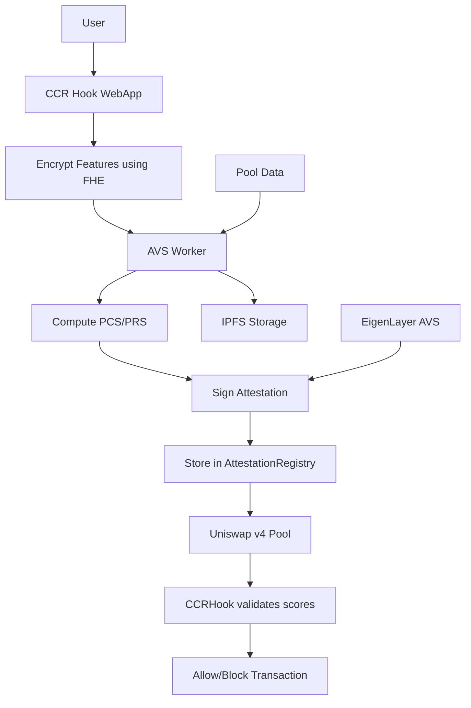

# CCR Hook - Confidential Credit-Risk Hook for Uniswap v4

[](LICENSE)
[](https://nodejs.org/)
[](https://docs.soliditylang.org/)
[](https://nextjs.org/)

## Table of Contents

- [Project Overview](#project-overview)
- [Architecture Overview](#architecture-overview)
- [Component Documentation](#component-documentation)
  - [AVS Worker](#avs-worker)
  - [CCR Hook WebApp](#ccr-hook-webapp)
  - [Smart Contracts](#smart-contracts)
  - [EigenCloud](#eigencloud)
- [Installation Guide](#installation-guide)
- [Usage Examples](#usage-examples)
- [API Documentation](#api-documentation)
- [Testing](#testing)
- [Deployment](#deployment)
- [Troubleshooting](#troubleshooting)
- [Contributing](#contributing)

## Project Overview

CCR Hook is a privacy-preserving credit scoring system for Uniswap v4 that enables risk-based liquidity management using **Fully Homomorphic Encryption (FHE)** and **Actively Validated Services (AVS)**. The system computes Personal Credit Scores (PCS) and Pool Risk Scores (PRS) to enable dynamic pool access controls while preserving user privacy.

### Key Features

- **Privacy-First Design**: User financial data never leaves their device unencrypted
- **FHE Encryption**: Computation on encrypted data using Fhenix CoFHE technology
- **Decentralized Validation**: EigenLayer AVS network for secure attestations
- **Dynamic Risk Management**: Real-time credit scoring and pool risk assessment
- **Uniswap v4 Integration**: Native hook implementation for seamless integration
- **Modern Web3 Stack**: Next.js frontend with TypeScript and modern React patterns

### What Problems It Solves

1. **Privacy Protection**: Traditional DeFi credit scoring requires exposing sensitive financial data
2. **Risk Management**: Pools lack sophisticated risk assessment mechanisms
3. **Credit-Based Access**: No way to provide differentiated access based on creditworthiness
4. **Attestation Infrastructure**: Secure, verifiable credit scoring requires trusted infrastructure

## Architecture Overview

CCR Hook consists of four main components working together to provide privacy-preserving credit scoring:

```
┌─────────────────────────────────────────────────────────────────────────────┐
│                             CCR Hook System                                │
└─────────────────────────────────────────────────────────────────────────────┘

┌─────────────────┐    ┌─────────────────┐    ┌─────────────────┐    ┌─────────────────┐
│                 │    │                 │    │                 │    │                 │
│  ccr-hook-      │    │   avs-worker    │    │   contracts     │    │   eigencloud   │
│  webapp         │    │                 │    │                 │    │                 │
│                 │    │                 │    │                 │    │                 │
│ Next.js App     │◄──►│ Express Server  │◄──►│ Solidity        │◄──►│ AVS Operator   │
│ TypeScript      │    │ FHE Computing   │    │ Uniswap v4 Hook │    │ EigenLayer     │
│ Web3 Frontend   │    │ Attestations    │    │ Attestation Reg │    │ Infrastructure  │
│                 │    │ IPFS Storage    │    │                 │    │                 │
└─────────────────┘    └─────────────────┘    └─────────────────┘    └─────────────────┘
```

### System Flow



### Data Flow

1. **User Interaction**: User connects wallet and provides encrypted financial data
2. **FHE Encryption**: Sensitive data encrypted client-side using CoFHE
3. **AVS Processing**: Encrypted data sent to AVS worker for computation
4. **Score Computation**: PCS (Personal Credit Score) and PRS (Pool Risk Score) calculated
5. **Attestation Signing**: Results signed by AVS operator
6. **On-chain Storage**: Attestations stored in AttestationRegistry contract
7. **Hook Validation**: CCRHook validates scores before allowing Uniswap operations

## Component Documentation

### AVS Worker

The AVS Worker is the core backend service that handles FHE computation, attestation signing, and IPFS storage.

#### Technology Stack
- **Runtime**: Node.js 18+
- **Framework**: Express.js 5.1
- **FHE Library**: CoFHE (Fhenix protocol)
- **Blockchain**: Ethers.js 6.15
- **Storage**: IPFS via ipfs-http-client
- **Security**: Helmet, CORS, Rate limiting

#### Key Features
- FHE encryption/decryption of user features
- PCS (Personal Credit Score) computation
- PRS (Pool Risk Score) computation
- Attestation signing with operator keys
- IPFS metadata and proof storage
- Batch processing capabilities

#### Installation

```bash
cd avs-worker
npm install
```

#### Configuration

Create a `.env` file in the `avs-worker` directory:

```env
# Server Configuration
PORT=3000
NODE_ENV=development

# Operator Configuration
OPERATOR_PRIVATE_KEY=your_operator_private_key_here

# FHE Configuration
FHE_ENABLED=true

# IPFS Configuration
IPFS_ENABLED=true
IPFS_HOST=localhost
IPFS_PORT=5001
IPFS_PROTOCOL=http
```

#### Running the Service

```bash
# Development mode
npm run dev

# Production mode
npm start

# Docker mode
npm run docker:build
npm run docker:run
```

#### API Endpoints

| Endpoint | Method | Description |
|----------|--------|-------------|
| `/health` | GET | Health check and status |
| `/fhe/public-key` | GET | Get FHE public key |
| `/fhe/encrypt` | POST | Encrypt features or pool metrics |
| `/compute/pcs` | POST | Compute Personal Credit Score |
| `/compute/prs` | POST | Compute Pool Risk Score |
| `/compute/batch` | POST | Batch computation (up to 10 requests) |
| `/ipfs/upload` | POST | Upload data to IPFS |
| `/ipfs/metadata/:hash` | GET | Retrieve IPFS metadata |

### CCR Hook WebApp

Modern Next.js application providing the user interface for the CCR Hook system.

#### Technology Stack
- **Framework**: Next.js 15.5 with App Router
- **Language**: TypeScript 5+
- **Styling**: Tailwind CSS 3.4 with custom design system
- **UI Components**: Radix UI primitives + shadcn/ui
- **Animations**: Framer Motion 12
- **Web3**: wagmi v2, RainbowKit v2, viem v2
- **State Management**: Tanstack Query v5

#### Key Features
- **Glassmorphism Design**: Modern glass-like UI components
- **Privacy-First UX**: Clear data handling explanations
- **Credit Tier System**: Bronze to Diamond tier progression
- **Interactive Demo**: Credit scoring simulation
- **Pool Explorer**: Browse and analyze Uniswap pools
- **Swap Simulator**: Test swaps with credit requirements

#### Installation

```bash
cd ccr-hook-webapp
npm install
```

#### Configuration

Create a `.env.local` file:

```env
NEXT_PUBLIC_WALLETCONNECT_PROJECT_ID=your_walletconnect_project_id
NEXT_PUBLIC_AVS_WORKER_URL=http://localhost:3000
```

#### Development

```bash
# Start development server with Turbopack
npm run dev

# Build for production
npm run build

# Start production server
npm start
```

#### Project Structure

```
src/
├── app/                    # Next.js App Router pages
│   ├── demo/              # Interactive demo page
│   ├── dashboard/         # User dashboard
│   ├── pools/             # Pool explorer
│   ├── api/               # API routes
│   └── layout.tsx         # Root layout with providers
├── components/
│   ├── ccr/               # CCR-specific components
│   │   ├── AttestationCard.tsx
│   │   ├── PoolCard.tsx
│   │   └── XPProgress.tsx
│   ├── navigation/        # Navigation components
│   ├── sections/          # Landing page sections
│   └── ui/                # shadcn/ui components
└── lib/
    ├── types.ts           # TypeScript definitions
    ├── utils.ts           # Utility functions
    └── wagmi.ts           # Web3 configuration
```

### Smart Contracts

Solidity contracts implementing the core CCR Hook functionality on Ethereum.

#### Technology Stack
- **Language**: Solidity 0.8.25
- **Framework**: Foundry
- **Dependencies**: OpenZeppelin, Uniswap v4 Core
- **FHE Integration**: Fhenix CoFHE contracts
- **Testing**: Forge testing framework

#### Core Contracts

| Contract | Description |
|----------|-------------|
| `CCRHook.sol` | Main Uniswap v4 hook implementing credit risk validation |
| `AttestationRegistry.sol` | Registry for storing and verifying operator attestations |
| `FHEAttestationRegistry.sol` | FHE-enabled version with encrypted data support |
| `Policy.sol` | Risk policy management and configuration |

#### Key Features
- **Uniswap v4 Hook**: Native integration with `beforeSwap` and `beforeAddLiquidity`
- **Credit Score Validation**: Enforces minimum PCS requirements
- **Pool Risk Assessment**: Validates maximum PRS thresholds
- **Attestation Verification**: ECDSA signature verification of operator attestations
- **Access Control**: Role-based operator management

#### Installation

```bash
cd contracts
forge install
```

#### Compilation

```bash
forge build
```

#### Testing

```bash
# Run all tests
forge test

# Run with gas reporting
forge test --gas-report

# Run specific test file
forge test --match-path test/CCRHook.t.sol
```

#### Deployment

```bash
# Deploy to local anvil
forge script script/Deploy.s.sol --rpc-url http://localhost:8545 --broadcast

# Deploy to testnet
forge script script/Deploy.s.sol --rpc-url $RPC_URL --private-key $PRIVATE_KEY --broadcast
```

#### Configuration

Edit `foundry.toml` for your deployment needs:

```toml
[profile.default]
src = "src"
out = "out"
libs = ["lib"]
solc = "0.8.25"
optimizer = true
optimizer_runs = 200
via_ir = true
```

### EigenCloud

AVS operator deployment infrastructure for EigenLayer integration.

#### Technology Stack
- **Platform**: EigenLayer AVS
- **CLI**: EigenLayer Devkit CLI
- **Infrastructure**: Docker, Docker Compose
- **Monitoring**: Prometheus, Grafana (optional)

#### Features
- **Operator Registration**: Register with EigenLayer contracts
- **Stake Management**: Handle operator and delegator stakes
- **Service Management**: Run AVS worker with proper monitoring
- **Reward Distribution**: Automatic reward claiming and distribution

#### Installation

```bash
cd eigencloud
chmod +x devkit-setup.sh
./devkit-setup.sh
```

#### Configuration

Edit `config/operator.yaml`:

```yaml
operator:
  address: "0x..."
  earnings_receiver_address: "0x..."
  delegation_approver_address: "0x000..."
  staker_opt_out_window_blocks: 0
  metadata_url: "https://your-metadata-url.com/metadata.json"

avs:
  registry_coordinator_address: "0x..."
  operator_state_retriever_address: "0x..."

chain:
  rpc_url: "https://eth-holesky.g.alchemy.com/v2/your-key"
  private_key_store_path: "/path/to/private/key"
```

#### Deployment

```bash
# Register operator with EigenLayer
devkit operator register config/operator.yaml

# Start AVS service
devkit avs start

# Monitor status
devkit operator status
```

## Installation Guide

### Prerequisites

- **Node.js**: Version 18 or higher
- **npm**: Version 8 or higher
- **Git**: Latest version
- **Docker**: For containerized deployment (optional)
- **Foundry**: For smart contract development

### System Requirements

- **Memory**: 4GB RAM minimum, 8GB recommended
- **Storage**: 10GB free space
- **Network**: Stable internet connection for IPFS and blockchain interaction

### Quick Start

1. **Clone the repository**
   ```bash
   git clone <repository-url>
   cd uniswap_incubator
   ```

2. **Install dependencies for all components**
   ```bash
   # AVS Worker
   cd avs-worker && npm install && cd ..

   # Frontend
   cd ccr-hook-webapp && npm install && cd ..

   # Contracts
   cd contracts && forge install && cd ..
   ```

3. **Configure environment variables**
   ```bash
   # Copy example environment files
   cp avs-worker/.env.example avs-worker/.env
   cp ccr-hook-webapp/.env.example ccr-hook-webapp/.env.local

   # Edit the files with your configuration
   ```

4. **Start the services**
   ```bash
   # Terminal 1: Start AVS Worker
   cd avs-worker && npm run dev

   # Terminal 2: Start Frontend
   cd ccr-hook-webapp && npm run dev

   # Terminal 3: Start local blockchain (optional)
   cd contracts && anvil
   ```

5. **Deploy contracts (optional for local development)**
   ```bash
   cd contracts
   forge script script/Deploy.s.sol --rpc-url http://localhost:8545 --broadcast
   ```

### Environment Variables

#### AVS Worker (.env)

```env
# Required
OPERATOR_PRIVATE_KEY=your_operator_private_key

# Optional
PORT=3000
NODE_ENV=development
FHE_ENABLED=true
IPFS_ENABLED=true
IPFS_HOST=localhost
IPFS_PORT=5001
IPFS_PROTOCOL=http
```

#### Frontend (.env.local)

```env
# Required
NEXT_PUBLIC_WALLETCONNECT_PROJECT_ID=your_walletconnect_project_id

# Optional
NEXT_PUBLIC_AVS_WORKER_URL=http://localhost:3000
NEXT_PUBLIC_CHAIN_ID=1
```

## Usage Examples

### Computing Personal Credit Score (PCS)

```javascript
// 1. Connect to AVS Worker
const avsWorker = 'http://localhost:3000';

// 2. Prepare user features
const features = {
  walletAge: 365,        // days
  transactionCount: 1500,
  successRate: 0.95,     // 95%
  lpContribution: 50000, // USD
  liquidationCount: 0
};

// 3. Encrypt features using FHE
const encryptResponse = await fetch(`${avsWorker}/fhe/encrypt`, {
  method: 'POST',
  headers: { 'Content-Type': 'application/json' },
  body: JSON.stringify({ features })
});
const { encryptedFeatures } = await encryptResponse.json();

// 4. Compute PCS
const pcsResponse = await fetch(`${avsWorker}/compute/pcs`, {
  method: 'POST',
  headers: { 'Content-Type': 'application/json' },
  body: JSON.stringify({
    encryptedFeatures,
    subject: userAddress
  })
});

const result = await pcsResponse.json();
console.log('PCS Score:', result.computation.score);
console.log('Credit Tier:', result.computation.tier);
```

### Computing Pool Risk Score (PRS)

```javascript
// 1. Gather pool metrics
const poolMetrics = {
  tvl: 10000000,           // $10M TVL
  volume24h: 2000000,      // $2M daily volume
  volatility: 0.15,        // 15% volatility
  concentration: 0.25,     // 25% concentrated in top LPs
  impermanentLoss: 0.05    // 5% IL risk
};

// 2. Compute PRS
const prsResponse = await fetch(`${avsWorker}/compute/prs`, {
  method: 'POST',
  headers: { 'Content-Type': 'application/json' },
  body: JSON.stringify({
    poolId: poolAddress,
    poolMetrics
  })
});

const result = await prsResponse.json();
console.log('PRS Score:', result.computation.score);
console.log('Risk Band:', result.computation.band);
```

### Using Smart Contracts

```solidity
// Deploy CCRHook with AttestationRegistry
AttestationRegistry registry = new AttestationRegistry();
CCRHook hook = new CCRHook(registry);

// Check if user has valid credit attestation
bool hasCredit = hook.hasValidCreditAttestation(userAddress);

// Get user's current credit score
uint256 creditScore = hook.getUserCreditScore(userAddress);

// Get pool's risk score
uint256 riskScore = hook.getPoolRiskScore(poolKey);
```

### Frontend Integration

```tsx
import { useAccount } from 'wagmi';
import { AttestationCard } from '@/components/ccr/AttestationCard';

export default function Dashboard() {
  const { address } = useAccount();

  return (
    <div className="p-6">
      <AttestationCard
        userAddress={address}
        onComputePCS={() => {/* Handle PCS computation */}}
        onPublishAttestation={() => {/* Handle publishing */}}
      />
    </div>
  );
}
```

## API Documentation

### AVS Worker REST API

#### Health Check

```http
GET /health
```

**Response:**
```json
{
  "status": "healthy",
  "timestamp": "2024-09-19T10:30:00.000Z",
  "operator": "0x742d35Cc6634C0532925a3b8D4C5b4E4EfF4",
  "fhe": {
    "initialized": true,
    "publicKeyAvailable": true
  },
  "ipfs": {
    "enabled": true,
    "connected": true
  }
}
```

#### FHE Public Key

```http
GET /fhe/public-key
```

**Response:**
```json
{
  "success": true,
  "publicKey": "base64-encoded-public-key",
  "fheEnabled": true
}
```

#### Compute PCS

```http
POST /compute/pcs
Content-Type: application/json

{
  "encryptedFeatures": "encrypted-feature-data",
  "subject": "0x742d35Cc..."
}
```

**Response:**
```json
{
  "success": true,
  "attestation": {
    "subject": "0x742d35Cc...",
    "type": "PCS",
    "pcsValue": 720,
    "pcsTier": "GOOD",
    "expiry": 1695985800
  },
  "signature": "0x1b2c3d...",
  "computation": {
    "score": 720,
    "tier": "GOOD",
    "breakdown": {
      "walletAge": 85,
      "transactionHistory": 90,
      "liquidityProvision": 75,
      "riskProfile": 70
    }
  }
}
```

#### Compute PRS

```http
POST /compute/prs
Content-Type: application/json

{
  "poolId": "0x88e6A0c2dDD26FEEb64F039a2c41296FcB3f5640",
  "poolMetrics": {
    "tvl": 10000000,
    "volume24h": 2000000,
    "volatility": 0.15,
    "concentration": 0.25,
    "impermanentLoss": 0.05
  }
}
```

**Response:**
```json
{
  "success": true,
  "attestation": {
    "poolId": "0x88e6A0c2dDD26FEEb64F039a2c41296FcB3f5640",
    "type": "PRS",
    "prsValue": 45,
    "prsBand": "MEDIUM",
    "expiry": 1695987600
  },
  "signature": "0x4a5b6c...",
  "computation": {
    "score": 45,
    "band": "MEDIUM",
    "breakdown": {
      "liquidityRisk": 40,
      "volatilityRisk": 60,
      "concentrationRisk": 35,
      "volumeRisk": 25
    }
  }
}
```

### Smart Contract API

#### CCRHook Contract

```solidity
interface ICCRHook {
    // View functions
    function hasValidCreditAttestation(address user) external view returns (bool);
    function hasValidRiskAttestation(PoolKey calldata key) external view returns (bool);
    function getUserCreditScore(address user) external view returns (uint256);
    function getPoolRiskScore(PoolKey calldata key) external view returns (uint256);

    // Hook functions (called by PoolManager)
    function beforeSwap(
        address sender,
        PoolKey calldata key,
        SwapParams calldata params,
        bytes calldata hookData
    ) external returns (bytes4, BeforeSwapDelta, uint24);

    function beforeAddLiquidity(
        address sender,
        PoolKey calldata key,
        ModifyLiquidityParams calldata params,
        bytes calldata hookData
    ) external returns (bytes4);
}
```

#### AttestationRegistry Contract

```solidity
interface IAttestationRegistry {
    struct Attestation {
        bytes32 attestationHash;
        address operator;
        uint256 issuedAt;
        uint256 expiry;
        string ipfsUri;
        bool revoked;
    }

    function publishAttestation(
        bytes32 subject,
        bytes32 attestationType,
        bytes calldata data,
        uint256 expiry,
        string calldata ipfsUri,
        bytes calldata signature
    ) external;

    function getLatestAttestation(
        bytes32 subject,
        bytes32 attestationType
    ) external view returns (Attestation memory);

    function isAttestationValid(
        bytes32 subject,
        bytes32 attestationType
    ) external view returns (bool);
}
```

## Testing

### AVS Worker Tests

```bash
cd avs-worker

# Run all tests
npm test

# Run tests in watch mode
npm run test:watch

# Run specific test file
npm test -- AttestationSigner.test.js
```

**Test Coverage:**
- FHE encryption/decryption
- PCS computation algorithms
- PRS computation algorithms
- Attestation signing and verification
- IPFS storage and retrieval
- API endpoint validation

### Smart Contract Tests

```bash
cd contracts

# Run all tests
forge test

# Run with verbose output
forge test -vvv

# Run specific test
forge test --match-test testSwapWithValidCredit

# Generate coverage report
forge coverage
```

**Test Scenarios:**
- Hook deployment and initialization
- Credit score validation for swaps
- Pool risk score enforcement
- Attestation registry operations
- Access control mechanisms
- Edge cases and error conditions

### Frontend Tests

```bash
cd ccr-hook-webapp

# Run component tests
npm run test

# Run E2E tests (if configured)
npm run test:e2e
```

### Integration Testing

Run the complete system integration test:

```bash
# 1. Start all services
cd avs-worker && npm run dev &
cd ccr-hook-webapp && npm run dev &
cd contracts && anvil &

# 2. Deploy contracts
cd contracts && forge script script/Deploy.s.sol --rpc-url http://localhost:8545 --broadcast

# 3. Run integration tests
npm run test:integration
```

## Deployment

### Development Deployment

1. **Local Blockchain**
   ```bash
   cd contracts
   anvil --port 8545 --chain-id 31337
   ```

2. **Deploy Contracts**
   ```bash
   forge script script/Deploy.s.sol --rpc-url http://localhost:8545 --broadcast
   ```

3. **Start Services**
   ```bash
   # AVS Worker
   cd avs-worker && npm run dev

   # Frontend
   cd ccr-hook-webapp && npm run dev
   ```

### Testnet Deployment

1. **Configure Environment**
   ```bash
   export RPC_URL="https://eth-holesky.g.alchemy.com/v2/your-key"
   export PRIVATE_KEY="your-private-key"
   export ETHERSCAN_API_KEY="your-etherscan-key"
   ```

2. **Deploy Contracts**
   ```bash
   cd contracts
   forge script script/Deploy.s.sol --rpc-url $RPC_URL --private-key $PRIVATE_KEY --broadcast --verify
   ```

3. **Deploy AVS Worker**
   ```bash
   cd avs-worker

   # Build Docker image
   docker build -t ccr-avs-worker .

   # Run container
   docker run -p 3000:3000 --env-file .env ccr-avs-worker
   ```

4. **Deploy Frontend**
   ```bash
   cd ccr-hook-webapp

   # Build for production
   npm run build

   # Deploy to Vercel
   vercel deploy --prod
   ```

### Production Deployment

#### Docker Compose Setup

Create `docker-compose.yml`:

```yaml
version: '3.8'

services:
  avs-worker:
    build: ./avs-worker
    ports:
      - "3000:3000"
    environment:
      - NODE_ENV=production
      - OPERATOR_PRIVATE_KEY=${OPERATOR_PRIVATE_KEY}
      - IPFS_HOST=ipfs
    depends_on:
      - ipfs
    restart: unless-stopped

  frontend:
    build: ./ccr-hook-webapp
    ports:
      - "3001:3000"
    environment:
      - NEXT_PUBLIC_AVS_WORKER_URL=http://avs-worker:3000
    restart: unless-stopped

  ipfs:
    image: ipfs/go-ipfs:latest
    ports:
      - "4001:4001"
      - "5001:5001"
      - "8080:8080"
    volumes:
      - ipfs_data:/data/ipfs
    restart: unless-stopped

volumes:
  ipfs_data:
```

Deploy with:

```bash
docker-compose up -d
```

#### EigenLayer AVS Deployment

```bash
cd eigencloud

# Configure operator
cp config/operator.yaml.example config/operator.yaml
# Edit with your operator details

# Register with EigenLayer
devkit operator register config/operator.yaml

# Start AVS
devkit avs start

# Monitor status
devkit operator status
```

### CI/CD Pipeline

Example GitHub Actions workflow (`.github/workflows/deploy.yml`):

```yaml
name: Deploy CCR Hook

on:
  push:
    branches: [main]

jobs:
  test:
    runs-on: ubuntu-latest
    steps:
      - uses: actions/checkout@v3
      - uses: actions/setup-node@v3
        with:
          node-version: '18'

      - name: Install dependencies
        run: |
          cd avs-worker && npm ci
          cd ../ccr-hook-webapp && npm ci

      - name: Run tests
        run: |
          cd avs-worker && npm test
          cd ../contracts && forge test

  deploy:
    needs: test
    runs-on: ubuntu-latest
    if: github.ref == 'refs/heads/main'
    steps:
      - uses: actions/checkout@v3

      - name: Deploy to production
        run: |
          # Deploy contracts
          cd contracts
          forge script script/Deploy.s.sol --rpc-url ${{ secrets.RPC_URL }} --private-key ${{ secrets.PRIVATE_KEY }} --broadcast

          # Deploy services
          docker-compose up -d
```

## Troubleshooting

### Common Issues

#### 1. FHE Initialization Failures

**Problem**: `Failed to initialize FHE Service: Module not found`

**Solution**:
```bash
# Install CoFHE dependencies
cd avs-worker
npm install cofhejs@latest

# Check Node.js version (requires 18+)
node --version

# Clear npm cache if needed
npm cache clean --force
```

#### 2. Contract Deployment Errors

**Problem**: `Error: insufficient funds for gas`

**Solution**:
```bash
# Check account balance
cast balance $ADDRESS --rpc-url $RPC_URL

# Estimate gas costs
forge script script/Deploy.s.sol --rpc-url $RPC_URL --estimate-gas

# Use lower gas price
forge script script/Deploy.s.sol --rpc-url $RPC_URL --gas-price 1000000000 --broadcast
```

#### 3. IPFS Connection Issues

**Problem**: `IPFS connection failed: connect ECONNREFUSED`

**Solution**:
```bash
# Start local IPFS node
ipfs daemon

# Or use remote IPFS gateway
export IPFS_HOST=ipfs.infura.io
export IPFS_PORT=5001
export IPFS_PROTOCOL=https
```

#### 4. Wallet Connection Problems

**Problem**: Frontend can't connect to wallet

**Solution**:
```bash
# Check WalletConnect project ID
echo $NEXT_PUBLIC_WALLETCONNECT_PROJECT_ID

# Update RainbowKit configuration
# Ensure chain is supported in wagmi config
```

#### 5. Attestation Verification Failures

**Problem**: `AttestationNotFound` error in hook

**Solution**:
```bash
# Check if operator is registered
cast call $ATTESTATION_REGISTRY "operators(address)(bool)" $OPERATOR_ADDRESS

# Verify attestation exists
cast call $ATTESTATION_REGISTRY "attestations(bytes32,bytes32)" $SUBJECT $TYPE

# Check signature format
# Ensure EIP-191 message format is used
```

### Debug Commands

#### Check Service Health

```bash
# AVS Worker status
curl http://localhost:3000/health

# Check FHE service
curl http://localhost:3000/fhe/public-key

# IPFS status
curl http://localhost:3000/ipfs/status
```

#### Contract Interaction

```bash
# Check contract deployment
cast code $CONTRACT_ADDRESS --rpc-url $RPC_URL

# Call view functions
cast call $CCR_HOOK "hasValidCreditAttestation(address)(bool)" $USER_ADDRESS

# Send transactions
cast send $ATTESTATION_REGISTRY "publishAttestation(...)" --private-key $PRIVATE_KEY
```

#### Frontend Debugging

```bash
# Check build issues
cd ccr-hook-webapp
npm run build

# Debug SSR issues
npm run dev -- --debug

# Check environment variables
npm run env:check
```

### Performance Optimization

#### AVS Worker

```javascript
// Enable clustering for production
const cluster = require('cluster');
const numCPUs = require('os').cpus().length;

if (cluster.isMaster) {
  for (let i = 0; i < numCPUs; i++) {
    cluster.fork();
  }
} else {
  require('./src/server.js');
}
```

#### Smart Contracts

```solidity
// Optimize gas usage
// Use packed structs
struct PackedAttestation {
  uint128 score;      // Instead of uint256
  uint64 expiry;      // Instead of uint256
  address operator;   // 20 bytes
}

// Batch operations
function batchPublishAttestations(
  bytes32[] calldata subjects,
  bytes32[] calldata types,
  bytes[] calldata data
) external;
```

### Monitoring and Logging

#### Application Metrics

```javascript
// Add Prometheus metrics
const promClient = require('prom-client');

const httpRequestDuration = new promClient.Histogram({
  name: 'http_request_duration_seconds',
  help: 'Duration of HTTP requests in seconds',
  labelNames: ['method', 'route']
});

// Track PCS computations
const pcsComputations = new promClient.Counter({
  name: 'pcs_computations_total',
  help: 'Total number of PCS computations'
});
```

#### Health Monitoring

```bash
# Set up health checks
curl -f http://localhost:3000/health || exit 1

# Monitor contract events
cast logs --from-block latest --to-block latest \
  --address $ATTESTATION_REGISTRY \
  --topic AttestationPublished
```

## Contributing

We welcome contributions to the CCR Hook project! Please follow these guidelines:

### Development Workflow

1. **Fork the repository**
   ```bash
   git clone https://github.com/your-username/ccr-hook.git
   cd ccr-hook
   ```

2. **Create a feature branch**
   ```bash
   git checkout -b feature/your-feature-name
   ```

3. **Make your changes**
   - Follow the existing code style
   - Add tests for new functionality
   - Update documentation as needed

4. **Test your changes**
   ```bash
   # Run all tests
   cd avs-worker && npm test
   cd ../contracts && forge test
   cd ../ccr-hook-webapp && npm run lint
   ```

5. **Submit a pull request**
   - Provide a clear description of changes
   - Reference any related issues
   - Ensure CI passes

### Code Standards

#### TypeScript/JavaScript
- Use TypeScript for new code
- Follow ESLint configuration
- Use Prettier for formatting
- Document functions with JSDoc

```typescript
/**
 * Computes Personal Credit Score from encrypted features
 * @param encryptedFeatures - FHE encrypted user features
 * @param subject - User address or identifier
 * @returns Promise resolving to PCS computation result
 */
async function computePCS(
  encryptedFeatures: string,
  subject: string
): Promise<PCSResult> {
  // Implementation
}
```

#### Solidity
- Follow Solidity style guide
- Use NatSpec documentation
- Optimize for gas efficiency
- Include comprehensive tests

```solidity
/**
 * @notice Validates user credit score before swap execution
 * @param user The user attempting to swap
 * @param requiredScore Minimum required credit score
 * @dev Reverts if user doesn't have valid attestation or score is too low
 */
function _validateUserCreditScore(address user, uint256 requiredScore) internal {
    // Implementation
}
```

### Testing Requirements

- **Unit Tests**: All new functions must have unit tests
- **Integration Tests**: Test component interactions
- **Contract Tests**: Use Foundry for comprehensive testing
- **Frontend Tests**: Test React components and user flows

### Documentation

- Update README.md for architectural changes
- Add inline documentation for complex logic
- Update API documentation for endpoint changes
- Include migration guides for breaking changes

### Security Considerations

- **Private Key Management**: Never commit private keys
- **Input Validation**: Validate all user inputs
- **Rate Limiting**: Implement appropriate rate limits
- **Access Controls**: Follow principle of least privilege
- **Audit Trail**: Log security-relevant events

### Issue Reporting

When reporting issues, please include:

1. **Environment details**: Node.js version, OS, browser
2. **Steps to reproduce**: Clear reproduction steps
3. **Expected behavior**: What should happen
4. **Actual behavior**: What actually happens
5. **Logs/Screenshots**: Relevant error messages or UI issues

### Feature Requests

For new features, please:

1. **Check existing issues**: Avoid duplicates
2. **Provide use case**: Explain why the feature is needed
3. **Suggest implementation**: Technical approach if you have ideas
4. **Consider breaking changes**: Impact on existing functionality

---

## License

This project is licensed under the MIT License - see the [LICENSE](LICENSE) file for details.

## Acknowledgments

- **EigenLayer** - AVS infrastructure and validation network
- **Fhenix** - FHE technology and CoFHE implementation
- **Uniswap** - v4 hook framework and integration support
- **OpenZeppelin** - Secure smart contract libraries
- **Foundry** - Ethereum development toolchain

---

**Built with ❤️ for the future of private DeFi**

For questions, support, or contributions, please:
- Open an issue on GitHub
- Join our Discord community
- Follow us on Twitter for updates

*CCR Hook enables privacy-preserving credit scoring for decentralized finance, making DeFi more accessible while protecting user privacy.*