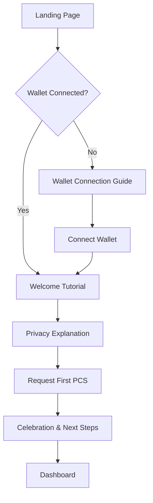
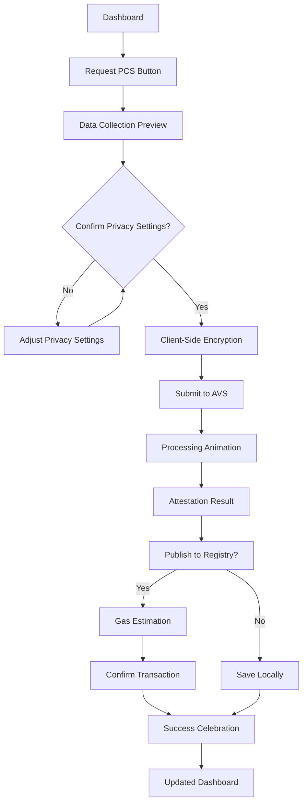
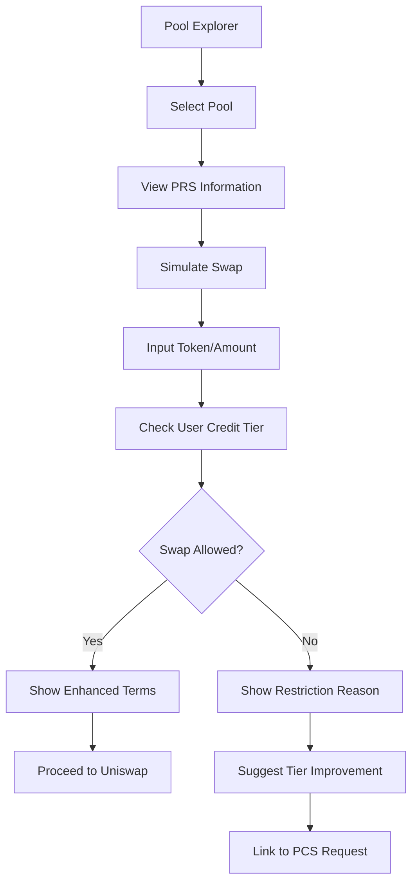

# CCR Hook — Comprehensive UI/UX Implementation Plan

**Version:** 2.0
**Date:** September 2024
**Purpose:** Advanced UI/UX implementation plan for the Confidential Credit-Risk Hook system, focusing on user-centered design, accessibility, and modern design patterns.

---

## Table of Contents

1. [Executive Summary](#1-executive-summary)
2. [Enhanced User Experience Strategy](#2-enhanced-user-experience-strategy)
3. [Comprehensive Design System Architecture](#3-comprehensive-design-system-architecture)
4. [User Journey Mapping & Flow Optimization](#4-user-journey-mapping--flow-optimization)
5. [Advanced Interaction Design Patterns](#5-advanced-interaction-design-patterns)
6. [Accessibility & Inclusive Design](#6-accessibility--inclusive-design)
7. [Performance-Optimized UX](#7-performance-optimized-ux)
8. [Mobile-First Responsive Design](#8-mobile-first-responsive-design)
9. [Error States & Edge Case Handling](#9-error-states--edge-case-handling)
10. [Onboarding & Education Flows](#10-onboarding--education-flows)
11. [Trust-Building UI Elements](#11-trust-building-ui-elements)
12. [Component Library Architecture](#12-component-library-architecture)
13. [Advanced Privacy-First UX Patterns](#13-advanced-privacy-first-ux-patterns)
14. [Gamification & Engagement Systems](#14-gamification--engagement-systems)
15. [Data Visualization & Dashboard Design](#15-data-visualization--dashboard-design)
16. [Implementation Timeline & Milestones](#16-implementation-timeline--milestones)

---

## 1. Executive Summary

The CCR Hook system represents a paradigm shift in DeFi risk management, combining privacy-preserving computation with transparent credit assessment. This comprehensive UI/UX plan transforms the original frontend specification into a world-class user experience that makes complex DeFi concepts accessible while maintaining the highest standards of privacy and security.

### Key Design Principles

- **Privacy by Design**: Every interaction prioritizes user privacy and data sovereignty
- **Progressive Disclosure**: Complex concepts revealed gradually to prevent cognitive overload
- **Trust Through Transparency**: Clear communication of processes without compromising privacy
- **Accessibility First**: Inclusive design ensuring equal access for all users
- **Performance Excellence**: Sub-2-second load times with optimized interactions

### Success Metrics

- **User Onboarding**: 85% completion rate for first PCS attestation
- **Trust Indicators**: 90% user confidence rating in privacy protection
- **Accessibility**: WCAG 2.2 AA compliance with AAA color contrast
- **Performance**: LCP < 1.5s, FID < 100ms, CLS < 0.1
- **Conversion**: 60% visitor-to-lead conversion rate

---

## 2. Enhanced User Experience Strategy

### 2.1 User Persona Framework

#### Primary Personas

**The DeFi Pioneer (35%)**
- Advanced DeFi user seeking privacy-preserving solutions
- Values technical transparency and cutting-edge protocols
- Needs: Detailed technical information, advanced configuration options

**The Institutional Participant (25%)**
- Treasury manager or fund operator managing large positions
- Requires compliance documentation and audit trails
- Needs: Enterprise features, bulk operations, reporting tools

**The Privacy-Conscious Trader (25%)**
- Retail user concerned about financial privacy
- Wants simple, secure trading experiences
- Needs: Clear privacy explanations, one-click operations

**The Protocol Explorer (15%)**
- Curious about new DeFi primitives
- May not have deep technical knowledge
- Needs: Educational content, guided experiences

### 2.2 User Mental Models

#### Simplified Credit Scoring Concept
- **Traditional Banking**: Credit scores determine loan eligibility
- **CCR Hook**: On-chain activity creates privacy-preserving credit tiers
- **Benefit**: Better swap conditions for trustworthy users

#### Privacy-First Computing
- **Data Stays Local**: Personal information never leaves your device
- **Encrypted Processing**: Computations happen on encrypted data
- **Zero-Knowledge Proofs**: Prove creditworthiness without revealing details

### 2.3 Behavioral Psychology Integration

#### Cognitive Load Reduction
- **Chunking**: Group related actions into logical sequences
- **Progressive Enhancement**: Start simple, reveal complexity on demand
- **Familiar Patterns**: Use established DeFi interaction patterns

#### Trust Building Through UX
- **Transparency Indicators**: Real-time privacy status indicators
- **Process Visualization**: Animated flows showing data protection
- **Authority Signals**: Integration with trusted protocols (Uniswap, EigenLayer)

---

## 3. Comprehensive Design System Architecture

### 3.1 Design Token Hierarchy

#### Color System
```scss
// Primary Palette
--color-primary-50: #f0fdfa;   // Lightest teal
--color-primary-100: #ccfbf1;  // Light teal
--color-primary-500: #0ea5a4;  // Core teal (from original spec)
--color-primary-600: #0d9488;  // Medium teal
--color-primary-900: #134e4a;  // Darkest teal

// Secondary Palette (Violet)
--color-secondary-50: #faf5ff;
--color-secondary-100: #f3e8ff;
--color-secondary-500: #7c3aed;  // Core violet (from original spec)
--color-secondary-600: #7c2d12;
--color-secondary-900: #581c87;

// Semantic Colors
--color-success: #10b981;
--color-warning: #f59e0b;
--color-error: #ef4444;
--color-info: #3b82f6;

// Credit Tier Colors
--color-tier-bronze: #cd7f32;
--color-tier-silver: #c0c0c0;
--color-tier-gold: #ffd700;
--color-tier-platinum: #e5e4e2;
--color-tier-diamond: #b9f2ff;
```

#### Typography Scale
```scss
// Font Families
--font-primary: 'Inter', system-ui, sans-serif;
--font-display: 'Playfair Display', serif;
--font-mono: 'JetBrains Mono', monospace;

// Type Scale (Perfect Fourth - 1.333)
--text-xs: 0.75rem;     // 12px
--text-sm: 0.875rem;    // 14px
--text-base: 1rem;      // 16px
--text-lg: 1.125rem;    // 18px
--text-xl: 1.25rem;     // 20px
--text-2xl: 1.5rem;     // 24px
--text-3xl: 2rem;       // 32px
--text-4xl: 2.5rem;     // 40px
--text-5xl: 3.33rem;    // 53px
--text-6xl: 4rem;       // 64px
```

#### Spacing System (8px Grid)
```scss
--space-px: 1px;
--space-0: 0;
--space-1: 0.25rem;  // 4px
--space-2: 0.5rem;   // 8px
--space-3: 0.75rem;  // 12px
--space-4: 1rem;     // 16px
--space-6: 1.5rem;   // 24px
--space-8: 2rem;     // 32px
--space-12: 3rem;    // 48px
--space-16: 4rem;    // 64px
--space-24: 6rem;    // 96px
--space-32: 8rem;    // 128px
```

### 3.2 Component Taxonomy

#### Atomic Components
- **Button**: 8 variants (primary, secondary, ghost, outline, destructive, success, loading, disabled)
- **Input**: Text, number, password, search with validation states
- **Badge**: Status indicators, tier badges, notification counts
- **Avatar**: User/protocol representations with fallbacks
- **Icon**: 200+ SVG icons with consistent styling
- **Spinner**: Loading states with multiple variants

#### Molecular Components
- **Form Field**: Label + input + validation + help text
- **Search Box**: Input + dropdown results + keyboard navigation
- **Tooltip**: Contextual information with smart positioning
- **Toast**: Success/error/warning notifications
- **Modal**: Centered overlays with backdrop and focus management
- **Dropdown**: Menu items with keyboard navigation

#### Organism Components
- **Navigation**: Top nav, side nav, breadcrumbs
- **Data Tables**: Sortable, filterable, paginated tables
- **Card Layouts**: Content cards with various configurations
- **Forms**: Multi-step forms with validation and progress
- **Charts**: Data visualization components
- **Hero Sections**: Landing page hero variants

### 3.3 Glassmorphism Design Language

#### Visual Hierarchy
- **Primary Glass**: 10% opacity, 20px blur, subtle border
- **Secondary Glass**: 5% opacity, 15px blur, minimal border
- **Accent Glass**: Colored glass with gradient overlays

#### Elevation System
```scss
// Shadow Scale
--shadow-sm: 0 1px 2px 0 rgb(0 0 0 / 0.05);
--shadow-base: 0 1px 3px 0 rgb(0 0 0 / 0.1), 0 1px 2px -1px rgb(0 0 0 / 0.1);
--shadow-md: 0 4px 6px -1px rgb(0 0 0 / 0.1), 0 2px 4px -2px rgb(0 0 0 / 0.1);
--shadow-lg: 0 10px 15px -3px rgb(0 0 0 / 0.1), 0 4px 6px -4px rgb(0 0 0 / 0.1);
--shadow-xl: 0 20px 25px -5px rgb(0 0 0 / 0.1), 0 8px 10px -6px rgb(0 0 0 / 0.1);
--shadow-2xl: 0 25px 50px -12px rgb(0 0 0 / 0.25);
```

---

## 4. User Journey Mapping & Flow Optimization

### 4.1 Primary User Flows

#### Flow 1: First-Time User Onboarding


**Optimization Points:**
- **Reduce Friction**: One-click wallet connection with popular providers
- **Build Trust**: Step-by-step privacy explanation with visual aids
- **Immediate Value**: Show potential credit tier during onboarding
- **Social Proof**: Display anonymized success statistics

#### Flow 2: PCS Attestation Request


**Optimization Points:**
- **Transparency**: Show exactly what data will be processed
- **Control**: Allow users to adjust privacy settings
- **Feedback**: Real-time processing updates with ETA
- **Options**: Clear choice between local storage and on-chain publication

#### Flow 3: Pool Risk Assessment & Swap Simulation


**Optimization Points:**
- **Instant Feedback**: Real-time swap feasibility checking
- **Clear Explanations**: Why swaps are restricted or enhanced
- **Actionable Guidance**: How to improve credit tier
- **Seamless Integration**: Smooth handoff to Uniswap interface

### 4.2 Micro-Interactions Map

#### Button Interactions
- **Hover**: 150ms ease-out scale(1.02) + shadow increase
- **Active**: 100ms ease-in scale(0.98)
- **Loading**: Spinner animation + disabled state
- **Success**: Brief green flash + checkmark icon

#### Card Interactions
- **Hover**: Subtle lift (4px) + glow effect
- **Click**: Slight press effect before navigation
- **Loading**: Skeleton animation for content areas
- **Error**: Red border pulse + shake animation

#### Form Interactions
- **Focus**: Input field glow + label animation
- **Validation**: Real-time feedback with color changes
- **Submission**: Loading state + progress indication
- **Success**: Green checkmark animation

---

## 5. Advanced Interaction Design Patterns

### 5.1 Privacy-Preserving Interaction Patterns

#### Encrypted Data Visualization
```tsx
// Progressive data revelation pattern
interface DataRevealProps {
  encryptedData: EncryptedValue;
  userPermission: boolean;
  revealTrigger: RevealTrigger;
}

// Visual pattern shows:
// 1. Encrypted state: "●●●●●●●● (Encrypted)"
// 2. Hover state: "Click to decrypt locally"
// 3. Revealed state: Actual value with re-encrypt option
```

#### Privacy Status Indicators
- **Green Shield**: Data encrypted and secure
- **Yellow Warning**: Partial data exposure (with explanation)
- **Red Alert**: Privacy concern (with mitigation steps)
- **Blue Info**: Educational privacy tip

### 5.2 Financial Data Interaction Patterns

#### Credit Score Visualization
```tsx
// Animated circular progress showing credit tier
// - Bronze: 0-299 (warm copper gradient)
// - Silver: 300-599 (cool silver gradient)
// - Gold: 600-799 (golden gradient)
// - Platinum: 800-899 (platinum gradient)
// - Diamond: 900-1000 (rainbow gradient)

interface CreditScoreDisplayProps {
  score: number;
  tier: CreditTier;
  progress: number; // Progress to next tier
  trends: ScoreTrend[]; // Historical trend data
}
```

#### Risk Assessment Heatmap
- **Pool Risk Visualization**: Color-coded grid showing risk levels
- **Hover Interactions**: Detailed risk breakdown tooltips
- **Click Interactions**: Navigate to detailed pool analysis
- **Comparison Mode**: Side-by-side pool risk comparisons

### 5.3 Web3 Integration Patterns

#### Transaction State Management
```tsx
interface TransactionState {
  status: 'idle' | 'preparing' | 'pending' | 'confirmed' | 'failed';
  hash?: string;
  gasEstimate?: bigint;
  confirmations: number;
  error?: Error;
}

// Visual states:
// - Preparing: Loading spinner + "Preparing transaction..."
// - Pending: Progress animation + "Confirm in wallet..."
// - Confirmed: Success animation + transaction link
// - Failed: Error state + retry option
```

#### Wallet Connection Flow
- **No Wallet**: Install wallet prompt with provider options
- **Wrong Network**: Network switching with visual guide
- **Connecting**: Loading state with wallet-specific branding
- **Connected**: Success state with address display + avatar

---

## 6. Accessibility & Inclusive Design

### 6.1 WCAG 2.2 AA Compliance

#### Color & Contrast
- **AA Compliance**: Minimum 4.5:1 contrast for normal text
- **AAA Target**: Aim for 7:1 contrast on critical elements
- **Color Independence**: Information never conveyed by color alone
- **High Contrast Mode**: Alternative color scheme for better visibility

#### Keyboard Navigation
- **Focus Management**: Logical tab order throughout application
- **Skip Links**: Jump to main content and navigation
- **Keyboard Shortcuts**: Alt+key combinations for frequent actions
- **Focus Indicators**: Clear visual focus states on all interactive elements

#### Screen Reader Support
- **Semantic HTML**: Proper heading hierarchy (h1-h6)
- **ARIA Labels**: Descriptive labels for complex interactions
- **Live Regions**: Dynamic content updates announced to screen readers
- **Alternative Text**: Descriptive alt text for all images and icons

### 6.2 Cognitive Accessibility

#### Simplified Language
- **Plain English**: Avoid jargon, use common terms
- **Explanatory Tooltips**: Hover/focus explanations for technical terms
- **Progressive Disclosure**: Start simple, add detail on request
- **Visual Hierarchy**: Clear content organization with headings

#### Memory Support
- **Persistent State**: Remember user preferences and progress
- **Breadcrumbs**: Clear navigation path indication
- **Auto-save**: Prevent data loss during form completion
- **Confirmation Dialogs**: Prevent accidental destructive actions

### 6.3 Motor Accessibility

#### Touch Targets
- **Minimum Size**: 44px x 44px touch targets
- **Adequate Spacing**: 8px minimum between interactive elements
- **Large Click Areas**: Extend clickable areas beyond visual boundaries
- **Gesture Alternatives**: Provide button alternatives to complex gestures

#### Error Recovery
- **Undo Actions**: Ability to reverse non-destructive actions
- **Error Correction**: Inline validation with correction suggestions
- **Timeout Extensions**: Option to extend session timeouts
- **Voice Input**: Support for voice-to-text input methods

### 6.4 Visual Accessibility

#### Text Customization
- **Font Size**: Scalable text up to 200% without horizontal scrolling
- **Line Height**: Minimum 1.5x font size for body text
- **Text Spacing**: Customizable letter and word spacing
- **Font Choice**: Option for dyslexia-friendly fonts

#### Motion Preferences
- **Reduced Motion**: Respect prefers-reduced-motion setting
- **Animation Controls**: Pause, play, and hide animation options
- **Essential Motion**: Only use animation for critical feedback
- **Focus Animation**: Subtle focus indicators that don't overwhelm

---

## 7. Performance-Optimized UX

### 7.1 Core Web Vitals Optimization

#### Largest Contentful Paint (LCP) < 1.5s
- **Hero Image Optimization**: WebP format with fallbacks
- **Above-fold Priority**: Preload critical resources
- **Font Display**: font-display: swap for faster text rendering
- **Code Splitting**: Load only essential JavaScript initially

#### First Input Delay (FID) < 100ms
- **Main Thread Optimization**: Minimize JavaScript execution time
- **Event Handler Optimization**: Debounced and throttled interactions
- **Web Workers**: Offload heavy computations (like FHE operations)
- **Progressive Enhancement**: Functional without JavaScript

#### Cumulative Layout Shift (CLS) < 0.1
- **Reserved Space**: Fixed dimensions for dynamic content
- **Font Loading**: Prevent font swap layout shifts
- **Image Dimensions**: Always specify width and height
- **Animation Containment**: Use transform and opacity for animations

### 7.2 Progressive Loading Strategies

#### Skeleton Screen Implementation
```tsx
// Component-level skeleton screens
interface SkeletonProps {
  variant: 'card' | 'table' | 'chart' | 'form';
  count?: number;
  animated?: boolean;
}

// Use cases:
// - Pool data loading: Table skeleton with shimmer
// - Credit score loading: Circular skeleton animation
// - Transaction history: Card skeleton grid
```

#### Lazy Loading Patterns
- **Image Lazy Loading**: Native loading="lazy" with IntersectionObserver fallback
- **Component Lazy Loading**: React.lazy() for route-level code splitting
- **Data Lazy Loading**: Load data as user scrolls or navigates
- **Module Lazy Loading**: Dynamic imports for heavy libraries

### 7.3 Caching & State Management

#### Service Worker Strategy
- **Network First**: Live data (prices, balances)
- **Cache First**: Static assets (images, fonts)
- **Stale While Revalidate**: User preferences, attestations
- **Background Sync**: Queue failed network requests

#### State Persistence
- **Local Storage**: User preferences and settings
- **Session Storage**: Temporary form data
- **IndexedDB**: Large datasets (transaction history)
- **Memory Cache**: Frequently accessed computed values

---

## 8. Mobile-First Responsive Design

### 8.1 Breakpoint Strategy

#### Mobile-First Breakpoints
```scss
// Mobile First (min-width approach)
$mobile: 375px;   // iPhone SE baseline
$tablet: 768px;   // iPad portrait
$desktop: 1024px; // Laptop
$wide: 1440px;    // Desktop
$ultra: 1920px;   // Large displays
```

#### Container Queries
```css
/* Component-based responsive design */
.attestation-card {
  container-type: inline-size;
}

@container (min-width: 300px) {
  .attestation-card .score {
    font-size: clamp(1.5rem, 4vw, 2rem);
  }
}
```

### 8.2 Touch-Optimized Interactions

#### Gesture Support
- **Swipe Navigation**: Horizontal swipes for tab switching
- **Pull-to-Refresh**: Refresh data in lists and dashboards
- **Long Press**: Context menus for advanced actions
- **Pinch-to-Zoom**: Zoom data visualizations on mobile

#### Mobile-Specific Components
- **Bottom Sheet**: Modal alternative for mobile
- **Floating Action Button**: Primary action access
- **Sticky Headers**: Keep navigation accessible during scroll
- **Safe Area Handling**: Respect device notches and home indicators

### 8.3 Progressive Web App Features

#### App-Like Experience
- **Install Prompt**: Custom PWA install experience
- **Splash Screen**: Branded loading screen
- **Status Bar**: Themed status bar integration
- **Navigation**: App-style navigation patterns

#### Offline Functionality
- **Offline Indicators**: Clear offline state communication
- **Cached Data**: Show last known data when offline
- **Queue Actions**: Queue transactions for when back online
- **Sync Notifications**: Notify users when data syncs

---

## 9. Error States & Edge Case Handling

### 9.1 Error Taxonomy

#### Network Errors
- **No Internet**: Friendly offline message with retry option
- **Slow Connection**: Loading states with progress indication
- **Server Error**: Clear error message with support contact
- **Timeout**: Automatic retry with manual option

#### Wallet Errors
- **Not Connected**: Clear call-to-action to connect wallet
- **Wrong Network**: Network switching guide with button
- **Insufficient Funds**: Clear explanation with funding options
- **Transaction Rejected**: User-friendly explanation of rejection

#### Application Errors
- **Data Loading Failed**: Retry option with error details
- **Encryption Failed**: Fallback options or troubleshooting
- **Invalid Input**: Inline validation with correction guidance
- **Rate Limited**: Clear explanation with wait time

### 9.2 Error Recovery Patterns

#### Progressive Error Handling
```tsx
interface ErrorBoundaryState {
  hasError: boolean;
  errorType: 'network' | 'wallet' | 'application' | 'unknown';
  errorMessage: string;
  retryCount: number;
  canRecover: boolean;
}

// Recovery strategies:
// 1. Automatic retry (network issues)
// 2. User-initiated retry (with exponential backoff)
// 3. Fallback content (when possible)
// 4. Graceful degradation (reduce functionality)
```

#### User-Friendly Error Messages
- **What Happened**: Clear description of the error
- **Why It Happened**: Simple explanation without technical jargon
- **What To Do**: Actionable steps to resolve the issue
- **Get Help**: Contact information or help documentation

### 9.3 Edge Case Scenarios

#### Empty States
- **No Attestations**: Encouraging message with clear next steps
- **No Pool Data**: Explanation with refresh option
- **Search No Results**: Helpful suggestions and alternatives
- **Connection Lost**: Status indicator with reconnection progress

#### Loading States
- **Initial Load**: App-level loading with progress indication
- **Data Refresh**: Subtle loading indicators that don't disrupt UX
- **Background Processing**: Non-blocking loading for secondary actions
- **Heavy Computation**: Progress indication for FHE operations

#### Extreme Data Scenarios
- **Very Large Numbers**: Abbreviated display with full value on hover
- **Very Small Numbers**: Scientific notation with decimal precision
- **Missing Data**: Clear indication of unavailable data
- **Stale Data**: Age indicator with refresh option

---

## 10. Onboarding & Education Flows

### 10.1 Progressive Onboarding Strategy

#### Welcome Sequence (First Visit)
```
1. Landing Impact (5 seconds)
   - Value proposition headline
   - Visual demonstration of privacy protection
   - Single call-to-action: "Get Started"

2. Concept Introduction (30 seconds)
   - What is confidential credit scoring?
   - How does it protect your privacy?
   - What benefits do you get?

3. Trust Building (15 seconds)
   - Security partnerships (EigenLayer, Fhenix)
   - Privacy guarantees
   - No data leaves your device

4. Getting Started (60 seconds)
   - Connect wallet guide
   - First PCS request walkthrough
   - Dashboard tour
```

#### Interactive Tutorial System
```tsx
interface TutorialStep {
  id: string;
  target: string; // CSS selector for highlight
  title: string;
  content: ReactNode;
  placement: 'top' | 'bottom' | 'left' | 'right';
  actions: TutorialAction[];
  prerequisite?: () => boolean;
}

// Tutorial progression:
// - Highlight interactive elements
// - Provide context and explanation
// - Allow users to practice actions
// - Confirm understanding before proceeding
```

### 10.2 Educational Content Strategy

#### Complex Concept Simplification

**Fully Homomorphic Encryption (FHE)**
- **Simple**: "Like a locked box that can be used without opening"
- **Technical**: "Computations on encrypted data without decryption"
- **Visual**: Animation showing locked data being processed

**Credit Scoring Process**
- **Simple**: "Your wallet activity creates a privacy-protected credit score"
- **Technical**: "On-chain data analysis with zero-knowledge proofs"
- **Visual**: Flowchart showing wallet → encryption → scoring → attestation

**AVS (Actively Validated Services)**
- **Simple**: "Independent validators who verify your credit score"
- **Technical**: "Decentralized network providing cryptographic attestations"
- **Visual**: Network diagram showing distributed validation

#### Contextual Help System
- **Tooltip Explanations**: Hover/click for quick definitions
- **Info Panels**: Expandable detailed explanations
- **Help Videos**: Short clips explaining complex concepts
- **Documentation Links**: Deep links to comprehensive guides

### 10.3 Progressive Disclosure Framework

#### Information Hierarchy
```
Level 1: Essential (Always Visible)
- Current credit tier
- Primary actions (Request PCS, View Pools)
- Wallet status

Level 2: Useful (Expandable)
- Score breakdown
- Historical trends
- Pool recommendations

Level 3: Advanced (On Demand)
- Technical implementation details
- Raw attestation data
- Advanced configuration options
```

#### Expertise-Based Customization
- **Beginner Mode**: Guided experience with explanations
- **Intermediate Mode**: Balanced information density
- **Expert Mode**: Full technical details and advanced controls
- **Auto-detection**: Infer expertise from wallet activity patterns

---

## 11. Trust-Building UI Elements

### 11.1 Security Visualization

#### Privacy Protection Indicators
```tsx
interface PrivacyIndicatorProps {
  status: 'secure' | 'processing' | 'at-risk';
  details: {
    encryption: boolean;
    localProcessing: boolean;
    dataSharing: DataSharingLevel;
  };
  onViewDetails: () => void;
}

// Visual states:
// - Secure: Green shield with checkmark
// - Processing: Blue shield with loading animation
// - At-risk: Yellow/red shield with warning icon
```

#### Real-time Security Status
- **Connection Security**: TLS status and certificate info
- **Wallet Security**: Connection type and security level
- **Data Processing**: Real-time encryption status
- **Privacy Score**: Calculated privacy protection level

### 11.2 Transparency Features

#### Process Visualization
```tsx
// Animated flow showing data journey
const DataFlowVisualization = () => (
  <div className="data-flow">
    <Step icon="wallet" status="complete">Your Wallet</Step>
    <Arrow animated />
    <Step icon="lock" status="active">Encrypt Locally</Step>
    <Arrow animated />
    <Step icon="shield" status="pending">AVS Processing</Step>
    <Arrow animated />
    <Step icon="certificate" status="future">Attestation</Step>
  </div>
);
```

#### Audit Trail Display
- **Timestamped Actions**: All user actions with timestamps
- **Data Processing Log**: What data was processed when
- **Attestation History**: Complete history with expiration tracking
- **Export Options**: Download complete audit trail

### 11.3 Authority & Credibility Signals

#### Partnership Badges
- **EigenLayer**: "Secured by EigenLayer AVS"
- **Fhenix**: "Privacy powered by Fhenix FHE"
- **Uniswap**: "Integrated with Uniswap v4"
- **Certifications**: Security audit badges and compliance certifications

#### Social Proof Elements
- **Usage Statistics**: "10,000+ attestations issued" (anonymized)
- **Network Health**: "99.9% uptime" with real-time status
- **Community Size**: "Growing community of privacy-conscious DeFi users"
- **Testimonials**: User quotes about privacy and security experience

### 11.4 Risk Communication

#### Clear Risk Disclosure
```tsx
interface RiskDisclosureProps {
  risks: Risk[];
  severity: 'low' | 'medium' | 'high';
  mitigations: Mitigation[];
  userAcknowledgment: boolean;
}

// Risk categories:
// - Smart contract risk
// - Oracle risk
// - Slashing risk (for operators)
// - Regulatory risk
```

#### Confidence Intervals
- **Credit Score Confidence**: "Score: 750 ± 25 (95% confidence)"
- **Risk Assessment Confidence**: Visual confidence bands on risk charts
- **Prediction Accuracy**: Historical accuracy metrics for risk predictions
- **Data Quality Indicators**: How much data was available for scoring

---

## 12. Component Library Architecture

### 12.1 Atomic Design Implementation

#### Atoms (Basic Building Blocks)
```tsx
// Button Component with full variant support
interface ButtonProps {
  variant: 'primary' | 'secondary' | 'ghost' | 'outline' | 'destructive';
  size: 'sm' | 'md' | 'lg' | 'xl';
  loading?: boolean;
  disabled?: boolean;
  leftIcon?: ReactNode;
  rightIcon?: ReactNode;
  onClick?: (event: MouseEvent<HTMLButtonElement>) => void;
  children: ReactNode;
}

// Input Component with validation
interface InputProps {
  type: 'text' | 'email' | 'password' | 'number' | 'search';
  label?: string;
  placeholder?: string;
  helpText?: string;
  error?: string;
  required?: boolean;
  disabled?: boolean;
  leftAddon?: ReactNode;
  rightAddon?: ReactNode;
  onChange?: (value: string) => void;
}
```

#### Molecules (Component Combinations)
```tsx
// Form Field combining Label + Input + Validation
interface FormFieldProps {
  label: string;
  input: InputProps;
  validation?: ValidationRule[];
  helpText?: string;
  required?: boolean;
}

// Search Box with Results
interface SearchBoxProps {
  placeholder: string;
  onSearch: (query: string) => void;
  results: SearchResult[];
  onSelect: (result: SearchResult) => void;
  loading?: boolean;
  maxResults?: number;
}
```

#### Organisms (Complex Components)
```tsx
// Attestation Card with full functionality
interface AttestationCardProps {
  attestation: Attestation;
  showActions?: boolean;
  onPublish?: () => void;
  onDownload?: () => void;
  onRefresh?: () => void;
  variant: 'compact' | 'detailed';
}

// Pool Risk Dashboard
interface PoolRiskDashboardProps {
  pools: Pool[];
  userTier: CreditTier;
  filters: PoolFilter[];
  sorting: SortOption;
  onPoolSelect: (pool: Pool) => void;
  onFilterChange: (filters: PoolFilter[]) => void;
}
```

### 12.2 Component Composition Patterns

#### Render Props Pattern
```tsx
interface DataFetcherProps<T> {
  url: string;
  children: (data: T | null, loading: boolean, error: Error | null) => ReactNode;
  onSuccess?: (data: T) => void;
  onError?: (error: Error) => void;
}

// Usage:
<DataFetcher<Pool[]> url="/api/pools">
  {(pools, loading, error) => (
    <PoolGrid pools={pools} loading={loading} error={error} />
  )}
</DataFetcher>
```

#### Compound Components Pattern
```tsx
// Modal compound component
interface ModalComposition {
  Root: React.FC<ModalProps>;
  Trigger: React.FC<ModalTriggerProps>;
  Content: React.FC<ModalContentProps>;
  Header: React.FC<ModalHeaderProps>;
  Body: React.FC<ModalBodyProps>;
  Footer: React.FC<ModalFooterProps>;
}

// Usage:
<Modal.Root>
  <Modal.Trigger>Open Modal</Modal.Trigger>
  <Modal.Content>
    <Modal.Header>Title</Modal.Header>
    <Modal.Body>Content</Modal.Body>
    <Modal.Footer>Actions</Modal.Footer>
  </Modal.Content>
</Modal.Root>
```

### 12.3 Component Documentation

#### Storybook Integration
```tsx
// Component stories with comprehensive examples
export default {
  title: 'Components/AttestationCard',
  component: AttestationCard,
  parameters: {
    docs: {
      description: {
        component: 'Displays user credit attestation with tier badge, score, and actions.'
      }
    }
  }
} as Meta<typeof AttestationCard>;

export const Default: Story = {
  args: {
    attestation: mockAttestation,
    variant: 'detailed',
    showActions: true
  }
};

export const Compact: Story = {
  args: {
    attestation: mockAttestation,
    variant: 'compact',
    showActions: false
  }
};
```

#### Component API Documentation
- **Props Interface**: Complete TypeScript interface documentation
- **Usage Examples**: Multiple real-world usage examples
- **Accessibility Notes**: WCAG compliance information
- **Performance Notes**: Bundle size impact and optimization tips

---

## 13. Advanced Privacy-First UX Patterns

### 13.1 Data Sovereignty Patterns

#### Local-First Data Architecture
```tsx
interface PrivateDataManager {
  // Data never leaves device until explicitly encrypted
  collectWalletData: () => Promise<WalletData>;
  encryptForProcessing: (data: WalletData) => Promise<EncryptedData>;
  processLocally: (data: WalletData) => Promise<LocalInsights>;
  shareSelectively: (data: EncryptedData, recipient: string) => Promise<void>;
}

// UX patterns:
// 1. Show data collection preview before processing
// 2. Allow granular control over what data to include
// 3. Provide local-only insights when possible
// 4. Clear consent flow for data sharing
```

#### Granular Privacy Controls
```tsx
interface PrivacySettings {
  dataCategories: {
    transactionHistory: boolean;
    balanceInformation: boolean;
    liquidityProvisions: boolean;
    interactionPatterns: boolean;
  };
  retentionPeriod: number; // days
  sharingLevel: 'minimal' | 'standard' | 'comprehensive';
  auditTrail: boolean;
}

// Visual representation:
// - Toggle switches for each data category
// - Slider for retention period
// - Radio buttons for sharing level
// - Checkbox for audit trail
```

### 13.2 Zero-Knowledge UX Patterns

#### Proof Generation Visualization
```tsx
interface ZKProofGenerationProps {
  statement: string; // What we're proving
  witness: string; // What we know (hidden)
  proof: string; // The proof (shareable)
  onGenerate: () => Promise<void>;
  onVerify: () => Promise<boolean>;
}

// Animation shows:
// 1. Statement: "I have a credit score above 700"
// 2. Witness: "Hidden: My actual score is 750"
// 3. Proof: "Verifiable proof without revealing score"
```

#### Selective Disclosure Interface
```tsx
interface SelectiveDisclosureProps {
  availableClaims: Claim[];
  selectedClaims: string[];
  onClaimToggle: (claimId: string) => void;
  onGenerate: () => void;
}

// UX pattern:
// - Checkboxes for each available claim
// - Visual preview of what will be shared
// - Real-time privacy impact assessment
// - One-click generation of selective proof
```

### 13.3 Encryption Transparency

#### Encryption Status Dashboard
```tsx
interface EncryptionStatusProps {
  dataStatus: {
    localData: EncryptionStatus;
    inTransit: EncryptionStatus;
    atRest: EncryptionStatus;
  };
  encryptionMethod: string;
  keyManagement: KeyStatus;
}

// Status indicators:
// - Green: Fully encrypted and secure
// - Yellow: Partially encrypted (with explanation)
// - Red: Unencrypted (with remediation steps)
```

#### Key Management Interface
- **Key Generation**: Visual representation of key creation
- **Key Storage**: Options for key storage (local, hardware wallet, cloud)
- **Key Rotation**: Scheduled key rotation with user notifications
- **Key Recovery**: Secure key recovery flows with multiple options

---

## 14. Gamification & Engagement Systems

### 14.1 Credit Tier Progression

#### Tier Advancement Visualization
```tsx
interface TierProgressionProps {
  currentTier: CreditTier;
  currentScore: number;
  nextTier: CreditTier;
  scoreNeeded: number;
  timeToNextTier?: number;
  boostOpportunities: BoostAction[];
}

// Visual elements:
// - Animated progress bar with milestone markers
// - Tier badge evolution animation
// - Score improvement suggestions
// - Time-based progression estimates
```

#### Achievement System
```tsx
interface Achievement {
  id: string;
  name: string;
  description: string;
  icon: string;
  tier: 'bronze' | 'silver' | 'gold' | 'platinum' | 'diamond';
  progress: number; // 0-1
  unlocked: boolean;
  reward?: Reward;
}

// Achievement categories:
// - First Steps: "First PCS Request", "Wallet Connected"
// - Consistency: "30-Day Streak", "Monthly Active"
// - Advanced: "Multi-Pool LP", "High Score Maintainer"
// - Community: "Referral Bonus", "Protocol Advocate"
```

### 14.2 XP & Progression Systems

#### XP Earning Mechanisms
```typescript
interface XPAction {
  action: 'pcs_request' | 'pool_interaction' | 'tier_maintenance' | 'referral';
  baseXP: number;
  multipliers: XPMultiplier[];
  cooldown?: number; // seconds
  maxPerDay?: number;
}

const xpActions: XPAction[] = [
  {
    action: 'pcs_request',
    baseXP: 100,
    multipliers: [{ condition: 'first_time', multiplier: 2 }]
  },
  {
    action: 'tier_maintenance',
    baseXP: 50,
    multipliers: [{ condition: 'consecutive_days', multiplier: 1.1 }],
    maxPerDay: 1
  }
];
```

#### Level System Design
- **Level 1-10**: Beginner (focus on education and first interactions)
- **Level 11-25**: Intermediate (advanced features and optimizations)
- **Level 26-50**: Expert (community features and advanced strategies)
- **Level 51+**: Master (exclusive features and beta access)

### 14.3 Social & Community Features

#### Leaderboard System (Privacy-Preserving)
```tsx
interface LeaderboardEntry {
  rank: number;
  anonymousId: string; // Hash-based, unlinkable to wallet
  tier: CreditTier;
  xp: number;
  badges: string[];
  streak: number;
}

// Privacy features:
// - No wallet addresses visible
// - Optional participation (users can opt-out)
// - Aggregated statistics only
// - Time-delayed updates to prevent correlation
```

#### Referral & Community Building
- **Referral Tracking**: Privacy-preserving referral system
- **Community Challenges**: Group goals with shared rewards
- **Educational Sharing**: Share achievements without revealing financial data
- **Mentorship Program**: Connect experienced users with newcomers

---

## 15. Data Visualization & Dashboard Design

### 15.1 Credit Score Visualization

#### Primary Score Display
```tsx
interface CreditScoreVisualizationProps {
  score: number;
  tier: CreditTier;
  trend: ScoreTrend;
  confidence: number;
  lastUpdated: Date;
  historical?: ScoreHistory[];
}

// Visual design:
// - Large circular progress indicator
// - Color-coded tier representation
// - Trend arrow (up/down/stable)
// - Confidence interval display
// - Historical trend sparkline
```

#### Score Breakdown Components
```tsx
interface ScoreComponentsProps {
  components: {
    transactionVolume: { score: number; weight: number; };
    accountAge: { score: number; weight: number; };
    liquidityProvision: { score: number; weight: number; };
    paymentHistory: { score: number; weight: number; };
    diversification: { score: number; weight: number; };
  };
  showWeights: boolean;
  interactive: boolean;
}

// Interactive features:
// - Hover to see component explanation
// - Click to get improvement suggestions
// - Toggle weight visibility
// - Historical component performance
```

### 15.2 Risk Assessment Charts

#### Pool Risk Heatmap
```tsx
interface RiskHeatmapProps {
  pools: Pool[];
  riskMetrics: RiskMetric[];
  userTier: CreditTier;
  timeRange: TimeRange;
  onPoolSelect: (pool: Pool) => void;
}

// Visualization features:
// - Color-coded risk levels (green=low, red=high)
// - Size based on TVL or volume
// - Filtering by user accessibility
// - Interactive hover details
// - Time-based animation for trends
```

#### Risk Distribution Charts
- **Violin Plots**: Show risk distribution across credit tiers
- **Box Plots**: Compare risk ranges between different pools
- **Scatter Plots**: Correlation between user tier and pool access
- **Time Series**: Risk evolution over time periods

### 15.3 Dashboard Layout Architecture

#### Responsive Grid System
```tsx
interface DashboardLayout {
  mobile: GridDefinition;
  tablet: GridDefinition;
  desktop: GridDefinition;
  widgets: DashboardWidget[];
  customizable: boolean;
}

// Widget types:
// - Credit Score (primary)
// - Recent Activity (secondary)
// - Pool Recommendations (secondary)
// - XP Progress (tertiary)
// - Market Overview (tertiary)
// - Educational Tips (tertiary)
```

#### Customizable Dashboard
- **Drag & Drop**: Rearrange widgets based on user preference
- **Widget Selection**: Choose which widgets to display
- **Size Options**: Compact, standard, expanded widget sizes
- **Color Themes**: Multiple dashboard color schemes
- **Data Density**: Adjust information density per widget

---

## 16. Implementation Timeline & Milestones

### 16.1 Phase 1: Foundation (Weeks 1-2)

#### Week 1: Design System & Core Infrastructure
**Deliverables:**
- Design token implementation
- Core atomic components (Button, Input, Badge, etc.)
- Typography and color system
- Basic layout components
- Accessibility foundation

**Success Criteria:**
- All components pass accessibility audit
- Design tokens integrated with Tailwind CSS
- Storybook setup with initial component documentation
- TypeScript interfaces for all component props

#### Week 2: Page Layouts & Navigation
**Deliverables:**
- Landing page layout and hero section
- Navigation components (top nav, mobile menu)
- Basic routing setup with Next.js App Router
- Responsive layout system
- Error boundary implementation

**Success Criteria:**
- Mobile-first responsive design verified
- Core Web Vitals targets met (LCP < 2.5s)
- Navigation accessible via keyboard
- Error handling covers 404 and 500 scenarios

### 16.2 Phase 2: Core Functionality (Weeks 3-4)

#### Week 3: Wallet Integration & Authentication
**Deliverables:**
- RainbowKit wallet connection setup
- Wallet state management with Wagmi
- Network switching functionality
- User session management
- Web3 error handling

**Success Criteria:**
- Support for 6+ wallet providers
- Graceful handling of network switches
- Session persistence across browser sessions
- Clear error messages for all wallet states

#### Week 4: PCS Attestation Flow
**Deliverables:**
- Data collection and preview components
- FHE encryption integration (mock for MVP)
- AVS communication layer
- Attestation result display
- Local storage for attestations

**Success Criteria:**
- Complete PCS request flow functional
- User data never transmitted unencrypted
- Clear privacy indicators throughout flow
- Attestation cards display all relevant information

### 16.3 Phase 3: Advanced Features (Weeks 5-6)

#### Week 5: Pool Risk & Swap Simulation
**Deliverables:**
- Pool risk visualization components
- Swap simulation interface
- Risk assessment calculations
- Pool filtering and search
- Credit tier-based access controls

**Success Criteria:**
- Real-time swap simulation working
- Pool risk data accurately displayed
- Tier-based restrictions clearly communicated
- Search and filtering highly performant

#### Week 6: Dashboard & User Experience
**Deliverables:**
- User dashboard with customizable layout
- XP and achievement system
- Notification system
- Settings and preferences
- Export functionality

**Success Criteria:**
- Dashboard loads in under 1.5s
- All user preferences persist correctly
- Notification system covers all user actions
- Data export includes complete user history

### 16.4 Phase 4: Polish & Optimization (Weeks 7-8)

#### Week 7: Performance & Accessibility
**Deliverables:**
- Performance optimization (code splitting, caching)
- Complete accessibility audit and fixes
- SEO optimization
- Error state improvements
- Loading state enhancements

**Success Criteria:**
- Core Web Vitals all in "Good" range
- WCAG 2.2 AA compliance verified
- Lighthouse score > 95 for all metrics
- Error recovery tested in all scenarios

#### Week 8: Testing & Deployment
**Deliverables:**
- Comprehensive testing suite
- End-to-end user flows
- Security audit
- Performance monitoring setup
- Production deployment

**Success Criteria:**
- 95%+ test coverage for critical paths
- All user flows tested across devices
- Security vulnerabilities addressed
- Monitoring and alerting configured

### 16.5 Quality Assurance Checkpoints

#### Design Review Gates
- **Week 2**: Design system approval
- **Week 4**: Core flow UX review
- **Week 6**: Complete experience audit
- **Week 8**: Final design sign-off

#### Technical Review Gates
- **Week 2**: Architecture and performance baseline
- **Week 4**: Security and privacy implementation
- **Week 6**: Feature completeness and integration
- **Week 8**: Production readiness and monitoring

#### User Testing Milestones
- **Week 3**: First usability testing session
- **Week 5**: Feature validation testing
- **Week 7**: Accessibility testing with diverse users
- **Week 8**: Final user acceptance testing

---

## Conclusion

This comprehensive UI/UX implementation plan transforms the CCR Hook project from a technical proof-of-concept into a world-class user experience. By prioritizing privacy, accessibility, and user education, we create a trustworthy platform that makes complex DeFi concepts accessible to a broader audience.

The plan emphasizes progressive disclosure, allowing users to engage with the system at their comfort level while providing clear paths for education and advancement. The privacy-first approach ensures user sovereignty over their data while maintaining the transparency needed for trust in financial applications.

Success will be measured not just by technical metrics, but by user confidence, engagement, and the platform's ability to expand privacy-preserving DeFi adoption. The modular design system and component architecture ensure scalability as the platform evolves and new features are added.

This implementation plan serves as a living document that should be refined based on user feedback, technical discoveries, and evolving privacy standards. The foundation established here will support not just the current CCR Hook vision, but the future of privacy-preserving DeFi infrastructure.

---

**Next Steps:**
1. Stakeholder review and approval of this implementation plan
2. Design system prototyping and validation
3. Development team onboarding and task assignment
4. User research planning for validation testing
5. Technical architecture alignment with UX requirements

**Document Maintenance:**
- Weekly updates during development phases
- User feedback integration after each milestone
- Accessibility standards updates as guidelines evolve
- Performance benchmarks adjustment based on real-world usage